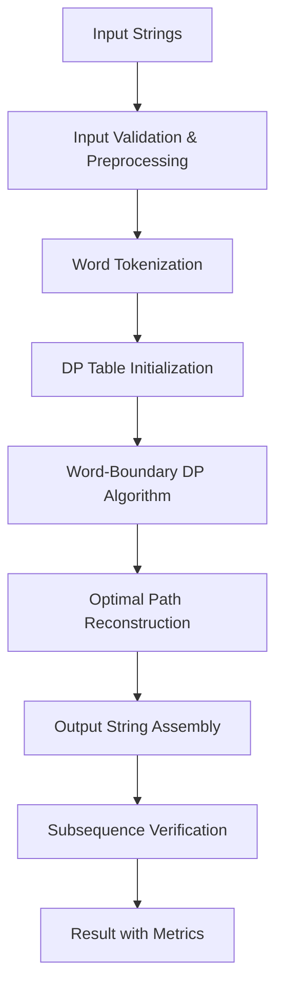

# Design Document: Shortest Combined String Algorithm

## Overview

This document outlines the design for an algorithm that finds the shortest possible combined string containing two input sentences as subsequences. The solution uses dynamic programming with word-boundary awareness to maximize character reuse while preserving word integrity and subsequence relationships.

The core challenge is balancing optimal character sharing with the constraints of maintaining whole words and proper spacing. The algorithm operates on a word-level granularity for DP state transitions while maintaining character-level precision for subsequence verification.

## Architecture

### High-Level Flow



### Core Components

1. **InputProcessor**: Handles validation, consecutive space normalization, and preprocessing
2. **WordTokenizer**: Splits strings into words while preserving space information
3. **DPSolver**: Implements the core dynamic programming algorithm with word-boundary constraints
4. **PathReconstructor**: Rebuilds the optimal solution from DP table
5. **SubsequenceVerifier**: Validates that output contains both inputs as subsequences
6. **ResultFormatter**: Assembles final output with metrics and validation results

## Components and Interfaces

### InputProcessor

```python
from dataclasses import dataclass
from typing import List

@dataclass
class PreprocessedInput:
    s1: str
    s2: str
    warnings: List[str]
    has_consecutive_spaces: bool

class InputProcessor:
    def validate_and_preprocess(self, s1: str, s2: str) -> PreprocessedInput:
        pass
```

**Responsibilities:**
- Detect and normalize consecutive spaces
- Validate input format
- Generate preprocessing warnings

### WordTokenizer

```python
@dataclass
class WordToken:
    word: str
    leading_spaces: int
    trailing_spaces: int
    original_index: int

class WordTokenizer:
    def tokenize(self, input_str: str) -> List[WordToken]:
        pass
    
    def reconstruct_from_tokens(self, tokens: List[WordToken]) -> str:
        pass
```

**Responsibilities:**
- Split strings into word tokens with space metadata
- Preserve original spacing information
- Enable word-boundary DP operations

### DPSolver

```python
from enum import Enum
from typing import List, Optional

class Operation(Enum):
    MATCH = "MATCH"
    INSERT_S1 = "INSERT_S1"
    INSERT_S2 = "INSERT_S2"
    SKIP = "SKIP"

@dataclass
class DPState:
    length: int
    s1_word_index: int
    s2_word_index: int
    operation: Operation

@dataclass
class DPResult:
    optimal_length: int
    dp_table: List[List[DPState]]
    solution: List['CombinedToken']

class DPSolver:
    def solve(self, s1_tokens: List[WordToken], s2_tokens: List[WordToken]) -> DPResult:
        pass
```

**Responsibilities:**
- Implement word-boundary aware DP algorithm
- Track optimal subproblem solutions
- Generate solution path for reconstruction

### Algorithm Design

#### Dynamic Programming Approach

The DP algorithm operates on word tokens rather than individual characters, with states representing:
- `dp[i][j]` = minimum length to combine first `i` words of s1 with first `j` words of s2

**State Transitions:**

1. **Word Match**: When words can be merged or overlapped
   - Condition: Words share common characters or can be strategically aligned
   - Cost: Length of merged word representation

2. **Insert from S1**: Take next word from s1 only
   - Cost: Length of s1 word + necessary spacing

3. **Insert from S2**: Take next word from s2 only
   - Cost: Length of s2 word + necessary spacing

4. **Strategic Spacing**: Add optimal spacing between words
   - Consider space sharing opportunities
   - Maintain subsequence integrity

#### Word Boundary Constraints

Each DP transition must ensure:
- Complete words are processed (no partial word states)
- Spacing decisions maintain word separation
- Subsequence order is preserved within each transition

#### Character Reuse Strategy

Within word transitions, the algorithm considers:
- **Prefix/Suffix Overlap**: When one word ends with characters that start another
- **Substring Containment**: When one word contains another as a substring
- **Character Interleaving**: Strategic character sharing while maintaining word boundaries.  Be careful not to insert space within a word, because insert space within a word is effectively breaking it into two words.

## Data Models

### Core Data Structures

```python
class TokenType(Enum):
    MERGED = "MERGED"
    S1_ONLY = "S1_ONLY"
    S2_ONLY = "S2_ONLY"
    SPACING = "SPACING"

@dataclass
class CombinedToken:
    content: str
    source_s1_words: List[int]
    source_s2_words: List[int]
    type: TokenType

@dataclass
class OptimizationMetrics:
    original_s1_length: int
    original_s2_length: int
    combined_length: int
    total_savings: int
    compression_ratio: float

@dataclass
class SubsequenceMatch:
    input_string: str
    output_positions: List[int]
    is_valid: bool
    is_invalid: bool  # Convenience property for clearer test assertions
    missing_chars: List[str]
    error_details: Optional[str]

@dataclass
class VerificationResult:
    is_valid: bool
    is_invalid: bool  # Convenience property for clearer test assertions
    s1_match: SubsequenceMatch
    s2_match: SubsequenceMatch
    validation_errors: List[str]

@dataclass
class AlgorithmResult:
    combined_string: str
    metrics: OptimizationMetrics
    is_valid: bool
    validation_errors: List[str]
    processing_warnings: List[str]
```

### DP Table Structure

The DP table uses a 2D array where each cell contains:
- **length**: Minimum length achievable for this subproblem
- **operation**: The operation that led to this optimal state
- **wordIndices**: Current position in both input word sequences
- **backpointer**: Reference for path reconstruction

## Error Handling

### Input Validation Errors

- **Empty Input**: Handle gracefully, empty strings are always valid subsequences of any output
- **Null/Undefined**: Throw descriptive error with usage guidance
- **Invalid Characters**: Process with warnings for unusual characters

### Algorithm Errors

- **DP Table Overflow**: Implement bounds checking and memory management
- **Infinite Loops**: Add iteration limits and cycle detection
- **Invalid State Transitions**: Validate each DP transition for consistency

### Verification Failures

- **Subsequence Violation**: Detailed error showing which subsequence failed
- **Length Constraint Violation**: Clear indication of constraint breach
- **Word Integrity Violation**: Identify specific words that were corrupted

## Testing Strategy

### Unit Testing

1. **InputProcessor Tests**
   - Consecutive space detection and normalization
   - Edge cases: empty strings, single characters, only spaces

2. **WordTokenizer Tests**
   - Correct word boundary detection
   - Space preservation accuracy
   - Reconstruction fidelity

3. **DPSolver Tests**
   - Optimal solution verification for known cases
   - Performance testing with various input sizes
   - Edge case handling (identical strings, no overlap, complete containment)

4. **SubsequenceVerifier Tests**
   - Empty string handling: empty strings are always valid subsequences
   - Single empty input: one empty string with non-empty output
   - Both empty inputs: both empty strings with any output content
   - Subsequence validation accuracy for all edge cases
   - Test readability: use `is_invalid` property instead of `not is_valid` for clearer assertions

### Integration Testing

1. **End-to-End Algorithm Tests**
   - Primary test case: s1="this is a red vase", s2="his son freddy love vase" → ≤26 chars
   - Comprehensive edge case coverage
   - Performance benchmarking

2. **Verification System Tests**
   - Subsequence validation accuracy
   - Metrics calculation correctness
   - Error reporting completeness

### Property-Based Testing

1. **Subsequence Preservation**: For any valid inputs, output must contain both as subsequences
2. **Length Optimality**: No manual combination should be shorter than algorithm output
3. **Word Integrity**: All original words must appear intact in output

### Performance Testing

- **Time Complexity Verification**: Confirm O(n*m) behavior across input sizes
- **Memory Usage**: Validate O(n*m) space complexity
- **Large Input Handling**: Test with sentences up to 1000+ characters

## Implementation Notes

### Optimization Opportunities

1. **Early Termination**: Stop DP when optimal bound is reached
2. **Memoization**: Cache expensive word comparison operations
3. **Space Optimization**: Use rolling arrays for DP table if memory is constrained

### Platform Considerations

- **String Handling**: Efficient string manipulation for target platform
- **Memory Management**: Consider garbage collection impact for large inputs
- **Unicode Support**: Handle international characters and emojis appropriately

### Extensibility Points

- **Custom Word Tokenization**: Allow pluggable tokenization strategies
- **Alternative Optimization Metrics**: Support different optimization goals beyond length
- **Batch Processing**: Design for processing multiple string pairs efficiently